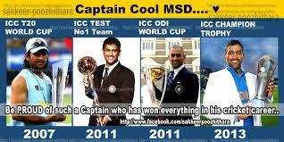
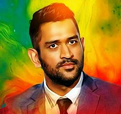
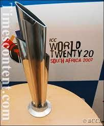
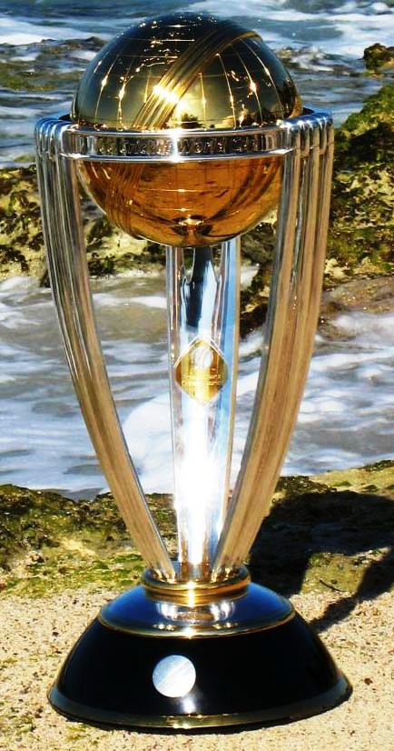
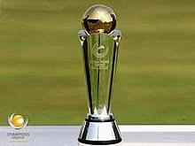
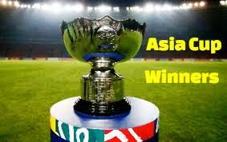

# adidev1019.github.io
<html>
<head><title>Msdians</title></head>
<body bgcolor="green">
<i><b>
<h1>MS DHONI(The Legend Of All Time)
</b></i>

MS DHONI <i>Legend of Indian Cricket</i>,best wicketkeeper of the world,best finisher of the world, having more than 100 half-centuries in International Cricket and the main ~The best captain of the World(The Captain Cool),and only captain to win all the three <i>ICC Trophies</i>,and three <i>IPL Titles for Cennai Super Kings.</i>  Mahendra Singh Dhoni help.... The Indian Territorial Army conferred the honorary rank of Lieutenant Colonel to Dhoni on  1 November 2011. He is the second Indian cricketer after Kapil Dev to receive this honour.It was a happy coincidence for MS Dhoni as he was conferred with the prestigious civilian honour on the seventh anniversary of their famous World Cup triumph.... MS Dhoni received country's third highest civilian award, Padma Bhushan, from President Ram Nath Kovind on 3-April,2018.

<a href="five.html">Life-History&ampSuccess Story Of MS DHONI</a>  
<b><i>Some of the Dhoni's Achievements for India</i></b>

<ul type="square">
<li><a href="one.html">1st T20 World Cup for India</a>
<li><a href="two.html">2nd ODI World Cup for India</a>
<li><a href="three.html">Champions Trophy For India</a>
<li><a href="four.html">2 Asia Cups for India</a>
</ul>
<ol>
<li><a href="#Cricket">MS Dhoni International Cricket Achievements</a> 
<li><a href="#MS">MS Dhoni Top Test Cricket Records</a> 
<li><a href="#MSD">MS Dhoni Top ODI Cricket Records</a> 
<li><a href="#Dhoni">MS Dhoni Top T20I  Cricket Records</a> 
<li><a href="#MSDhoni">MS Dhoni Awards and Achievements</a> 
</ol>
<a id=Cricket>
<b><i>MS Dhoni International Cricket Achievements:</i></b>

<ul>
<li>MS Dhoni holds a record of the most international stumpings of 161.
<li>As a captain, Dhoni has played the most number of 331 international matches.
<li>As a captain, Dhoni has hit 204 international sixes.
<li>While playing as a Wicket-keeper, MS Dhoni has also Bowled 9 times.
<li>Dhoni is the fourth Indian Cricketer to have completed century of half-centuries.
</ul></a>
<a id=MS><b><i>MS Dhoni Top Test Cricket Records:</i></b>

<ul>
<li>Under Dhoni's captaincy in 2009, for the first time, India had topped the Test cricket rankings.
<li>MS Dhoni holds the record for longest unbeaten run in Tests right from his debut to 11 matches.
<li>Dhoni is the first Indian wicket-keeper to complete 4000 test runs.
<li>Dhoni, eclipsing the record of Saurav Ganguly, has become the most successful Indian Test captain with 27 Test wins.
<li>As an Indian wicket-keeper, Dhoni has scored the fastest century with the total score of around 148 in Faisalabad, Pakistan.
</ul></a>
<a id=MSD><b><i>MS Dhoni Top ODI Cricket Records:</i></b>

<ul>
<li>Dhoni is the third captain to win 100 games.
<li>Dhoni scored 183 runs against Sri Lanka in 2005, this being the highest score secured by a wicket-keeper.
<li>Dhoni has highest batting average of 50.96 among the wicket-keepers.
<li>Dhoni, in 2017, became the first Indian to hit 200 sixes in ODIs, his overall ranking is fifth.
<li>Dhoni, as a captain and also as a wicket-keeper, holds the record for playing 199 matches, which is most number of matches in ODI history.
<li>In the fourth ODI against Sri Lanka, he joined the group of those few players who have represented India in 300+ ODI’s
<li>In the fifth ODI against Sri Lanka, which was his 301st ODI, Dhoni stumped Dananjaya off the bowling of Chahal, and became the only wicket-keeper in the world to have 100 stumpings to his name. Earlier he was tied up with Kumar Sangakara on 99 stumps.
<li>In the fifth ODI, Dhoni remained not out and thus became the only cricketer to have remained unbeaten in 73 innings in his ODI cricket career.
</ul></a>
<a id=Dhoni><b><i>MS Dhoni Top T20I  Cricket Records:</i></b>

<ul>
<li>Played the most T20I innings before scoring a fifty, was around 66.
<li>Dhoni is the first player to score 1000 runs in T20Is.
<li>Dhoni has played the most number of matches in T20I as a captain and has also served as a wicket-keeper.
<li>Dhoni groped most catches as wicket-keeper in T20 Internationals.
<li>He won 41 T20I matches as captain, which is the highest so far.
</ul></a>
<a id=MSDhoni><b><i>MS Dhoni Awards and Achievements:</i></b>

<ul>
Dhoni has been the recipient of many awards and achievements check them out below:
 
<li>Dhoni received Padma Bhushan on Monday the third highest civilian award on the seventh anniversary of the famous World Cup.
<li>Dhoni is the first player to receive this award twice: ICC ODI Player of the Year award in 2008 and 2009.
<li>Dhoni received The Rajiv Gandhi Khel Ratna award in 2007.
<li>Dhoni received The Padma Shri, India's fourth highest civilian honour, in 2009.
<li>In 2009, Dhoni was named as the captain of ICC World Test XI and ICC World ODI XI teams.
<li>Dhoni has been felicitated with Honorary doctorate degree by De Montfort University in August 2011.
<li>The Indian Territorial Army conferred the honorary rank of Lieutenant Colonel to Dhoni on 1st November 2011. After Kapil Dev, he is the second Indian cricketer to receive this honour.
<li>In 2011, Time magazine included Dhoni as one of the "Most Influential People in the World", in its annual Time 100 list.
<li>In 2012, MS Dhoni was rated as the 16th most marketable athlete in the world, by SportsPro.
<li>In 2013, Dhoni was felicitated with LG People's Choice Award
<li>In June 2015, Forbes ranked Dhoni at 23rd in the list of highest paid athletes in the world.
<li>In 2016, a biopic M.S. Dhoni: The Untold Story was made on him.
<li>MS Dhoni has been Nominated for the Padma Bhushan Award by BCCI for Dhoni's immense contributions to Indian Cricket.
<li>MS Dhoni Nominated For Padma Bhushan Award.  
<marquee>For further information <a href="https://en.wikipedia.org/wiki/MS_Dhoni#Early_life_and_background">Click Here</a>
</ul></a></marquee>

(Made By-Aditya Pandey)

</body>
</html>
